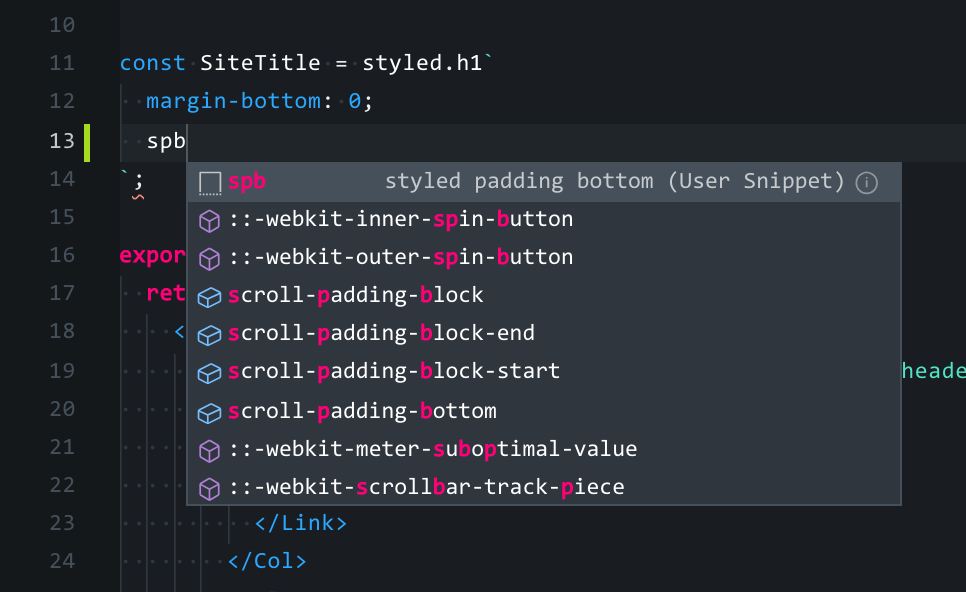
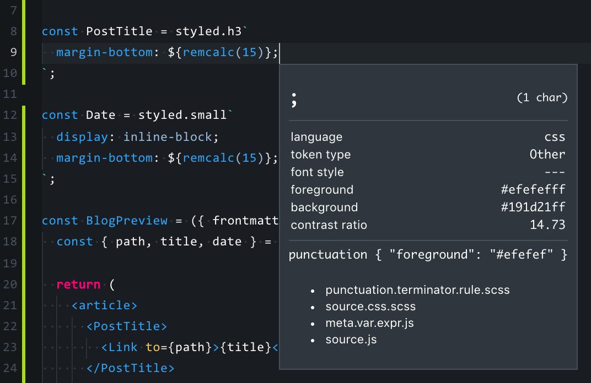
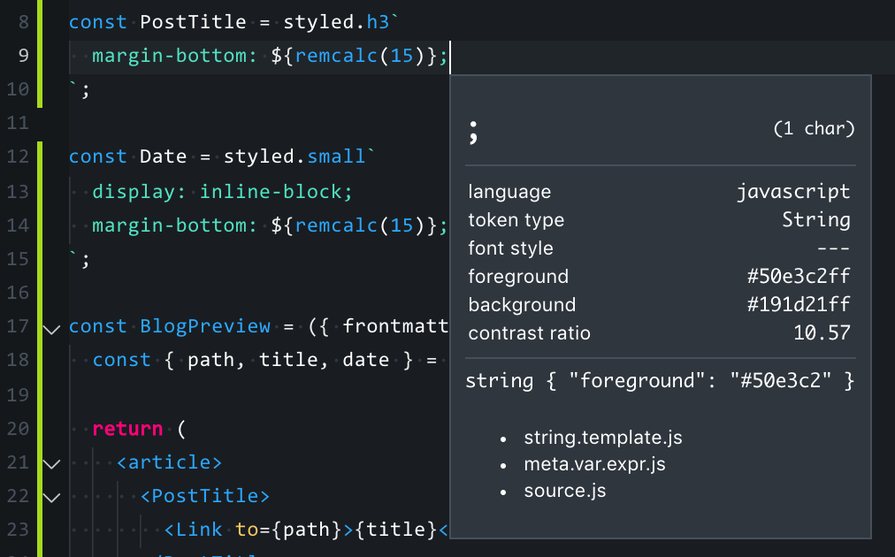

Requirements: [vscode-styled-components](https://github.com/styled-components/vscode-styled-components)

Recently whilst working on a site using styled-components I got tired of writing things like:

```javascript
`padding-top: ${({theme}) => theme.space[3]}``
```

### All. The. Time

So as a lot of people do, snippets to the rescue! As I was working within a JS file, I opened up the [javascript snippets](https://code.visualstudio.com/docs/editor/userdefinedsnippets#_create-your-own-snippets) to decalare a few snippets that will invariably save me time, money and sanity:

```json
{
  "styled padding bottom": {
    "prefix": "spb",
    "body": "padding-bottom: ${({theme}) => theme.space[$1]};"
  }
}
```

Then I switched back to my JS, entered `spb` where I want some padding-bottom, hit TAB and.... nothing 🤔

This might be a bit obvious to others but it took me a little bit to figure it out. Turns out using [vscode-styled-components](https://github.com/styled-components/vscode-styled-components) with VSCode enables correct syntax highlighting via the built in [TextMate Grammars](https://macromates.com/manual/en/language_grammars) definitions. Upon further reading on how this works under the hood I discovered `Inspect TM Scopes`, a util in VSCode for checking language scopes to develop syntax highlighting. Firing up the util it's interesting to have a look at what the inspector shows you.



Notice the language is `css` and TextMate has evaulated this line as a rule



Notice the language is `js`, TextMate has evaluated this as line as a template literal

This means, to get our snippets working, we can make sure we have the plugin enabled and move our snippet definition from `snippets/javascript.json` to `snippets/css.json`.
